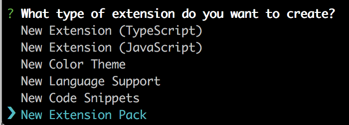
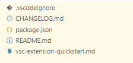

```toc
# This code block gets replaced with the TOC
```

# 插件包生成

## 前期准备

### 安装 Yeoman 工具

默认源下载慢的话, 可以替换为淘宝源.

```Bash
npm install -g yo generator-code
```

### 安装 vsce 打包工具

```bash
npm install -g vsce
```

## 创建扩展包工程

```bash
yo code
```



工程目录:



## 生成扩展

```bash
$ cd myExtension
$ vsce package
# myExtension.vsix generated

$ vsce publish
# <publisherID>.myExtension published to VS Code Marketplace

$ vsce login
# 输入用户名和PAT 进行更新
```

## 相关链接

发布市场: https://marketplace.visualstudio.com/manage/publishers/anaer

PAT设置: https://dev.azure.com/xxxx_orgnization/_usersSettings/tokens